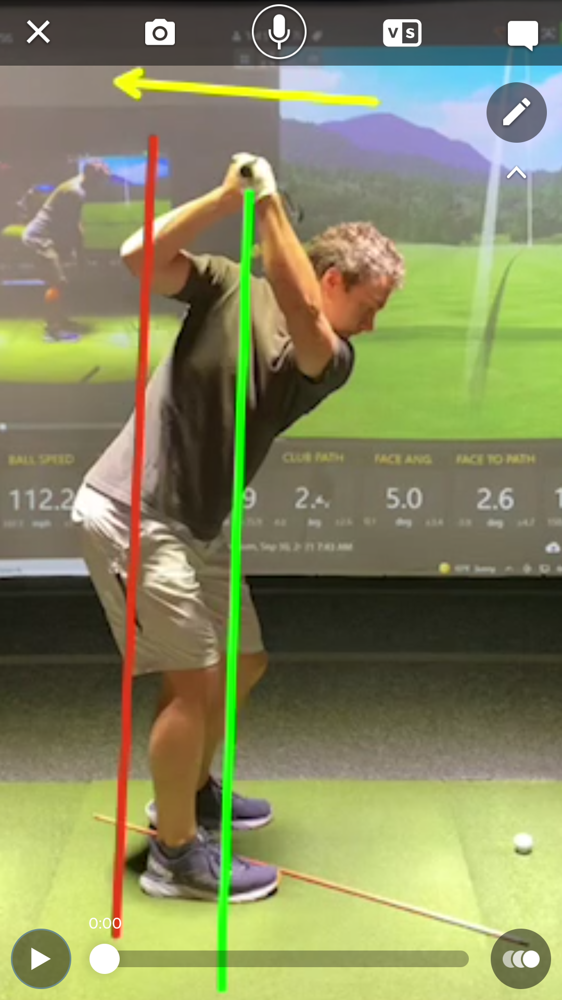
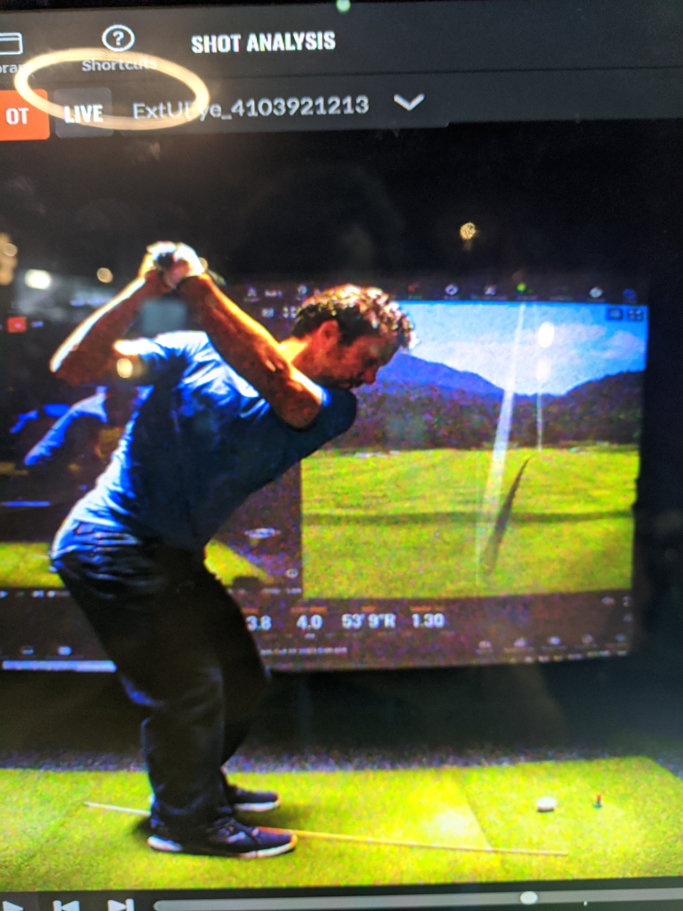

The Backswing!

First off, another reason that living in 2021 is the best time ever is golf simulators. The feedback on every swing is priceless. I honestly believe without them I would never get good at golf. I am not patient or skilled enough to assess my swing habits by feel alone.

Ok. I believe the following to be the case: Initially on the take-away, I whipped the club inside which caused me to crank my hands up high above the plane. What I am working on now is what feels like an extremely shallow backswing plain, but I think it is correct. My right elbow doesn't crank up. And being *on plane* will give me better ball-striking and more consistency. Plus all simpler motion will probably save my body a lot of hardship.

The tell-tale sign of accomplishing this is the angle of my forearm compared to my shoulder plain. My old swing had a very big difference. A better swing plane has a smaller angle.

I can't wait to keep working on my swing with my coach throughout the winter months.

